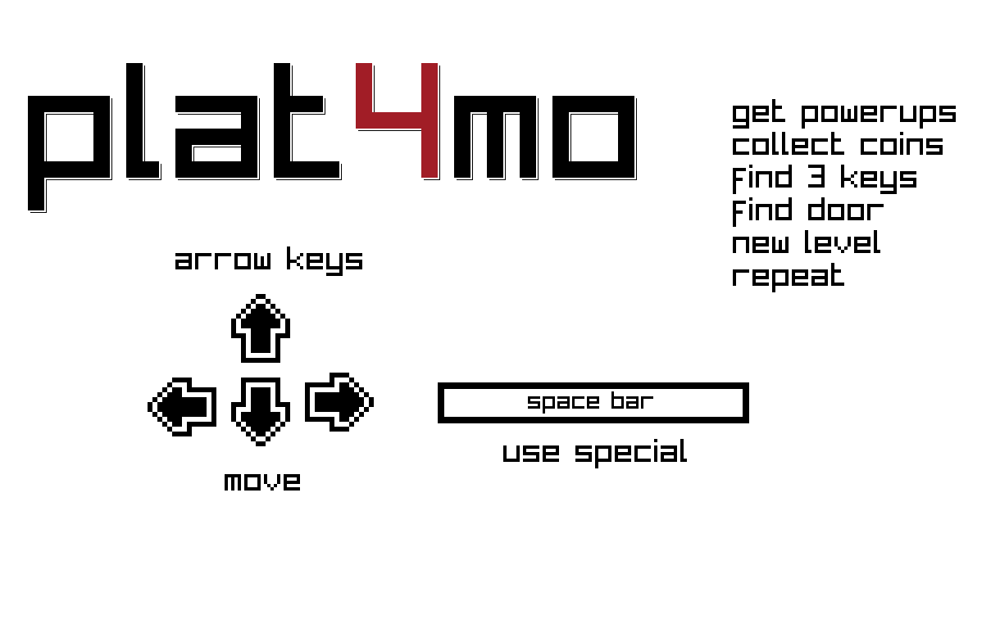
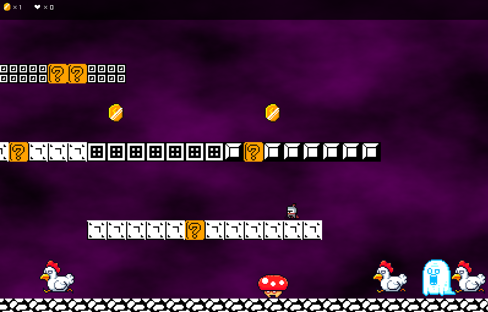

# plat4mo_roguelike
Basic engine for a roguelike platform game

A basic layout template for a roguelike platformer made with go and raylib. Arrow keys for movement, collect power ups and use space bar to activate the power up. Collect three keys and the level ends

  

 

